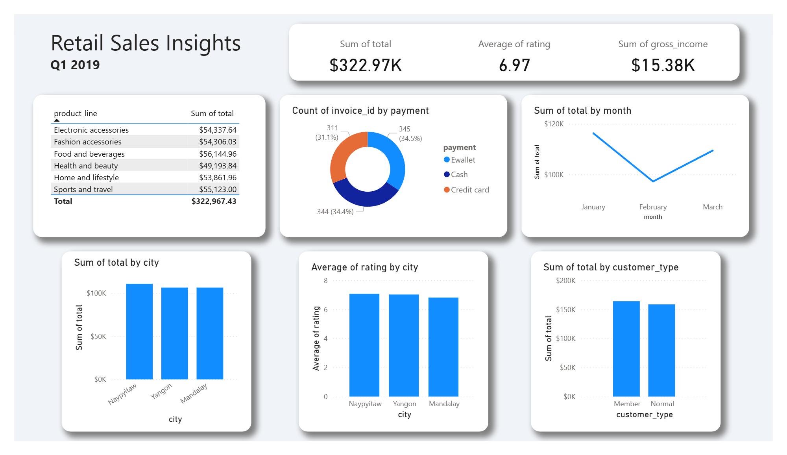

# Supermarket Sales Analytics Project

## Overview

This project analyzes transactional sales data from a fictional supermarket across three cities using **SQL** and **Power BI**. The goal is to extract meaningful insights about customer behavior, sales performance, and profitability trends from the raw data.

## Tools Used

- **PostgreSQL**: SQL queries for business analysis
- **Power BI**: Visualizing KPIs, trends, and breakdowns
- **Excel**: Cleaning and formatting the raw CSV data

## Key Business Questions Answered (SQL Analysis)

1. **Which store generates the most revenue?**
   - **Answer:** Naypyitaw leads in revenue generation.
   - **Impact:** Allocate more marketing and inventory to this location.

2. **Which product lines are most profitable?**
   - **Answer:** 'Sports and travel' has the highest profit margin.
   - **Impact:** Consider upselling or expanding this category.

3. **Which customer type spends more per transaction?**
   - **Answer:** Members spend more on average than normal customers.
   - **Impact:** Promote loyalty programs to increase customer value.

4. **What are peak hours for sales?**
   - **Answer:** The 7 PM hour has the highest number of transactions.
   - **Impact:** Optimize staffing and inventory during peak times.

5. **Which payment method drives higher spending?**
   - **Answer:** Cash users have the highest average spend.
   - **Impact:** Streamline cash checkout process and consider incentives.

6. **Which day brings in the most sales?**
   - **Answer:** Saturday is the top-performing day.
   - **Impact:** Schedule promotions and staffing accordingly.
  
## Advanced Analysis

1. **Which product lines show growing revenue trends?**
   - **Insight:** 'Electronic accessories' and 'Fashion accessories' had strong positive weekly revenue trends.
   - **Impact:** These categories show momentum and may benefit from increased stock or marketing.

2. **What customer segment spends the most?**
   - **Answer:** Male Members in Naypyitaw were the top spending segment.
   - **Impact:** High-LTV segments like this can be targeted with loyalty or referral programs.

3. **Does customer satisfaction correlate with spend?**
   - **Answer:** There is a **slightly positive correlation** between rating and total spend.
   - **Impact:** Investing in customer experience likely contributes to revenue growth.

4. **How much revenue comes from the top 10% of orders?**
   - **Answer:** The top 10% of transactions contribute **over 30%** of total revenue.
   - **Impact:** Focus on premium buyers through tailored services or upsells.

5. **Which product categories have inconsistent ratings?**
   - **Answer:** 'Home and lifestyle' and 'Sports and travel' showed the **highest variability** in customer ratings.
   - **Impact:** Investigate quality or service inconsistencies in these categories.

6. **What is the 7-day rolling average of daily sales?**
   - **Answer:** The rolling average reveals an upward sales trend in March, peaking near the end of the month.
   - **Impact:** March may be ideal for promotions, as sales volume trends upward naturally.
    

## Files Included

| File                                         | Description                                                                            |
| -------------------------------------------- | -------------------------------------------------------------------------------------- |
| `supermarket_sales_all_queries.sql`          | SQL script with business-driven analysis queries                                       |
| `supermarket_sales.csv`                      | Original raw dataset                                                                   |
| `supermarket_sales_cleaned.csv` | Cleaned version with formatting stripped, currency parsed, and column names simplified |

## Power BI Dashboard

Power BI connects directly to the PostgreSQL database to visualize the output from the SQL queries. The dashboard includes:

- KPIs (Total Revenue, AOV, Avg Rating)
- Monthly sales trends
- Product line performance
- Customer type and gender breakdowns

## How to Use This Project

1. Clone or download the repo
2. Open the SQL file and run the queries in a PostgreSQL client (pgAdmin)

## Credit

Data originally sourced from a Kaggle sample dataset and adapted for educational purposes.
